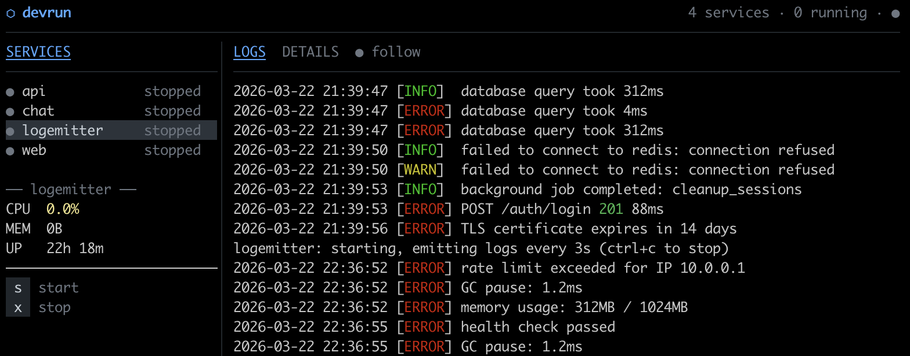

# devrun

> A lightweight process manager for developers who juggle many services.

Stop opening new terminal tabs. Stop forgetting start commands. Stop wondering what's running.
`devrun` gives you a single place to register, start, and monitor all your development services —
with a live TUI dashboard and persistent logs.



## Features

- **Register once, run anywhere** — save commands with names, no more muscle memory required
- **Targets** — group a subset of services under a name and start/stop them as a unit
- **Project-local configs** — commit a `devrun.yaml` and every command auto-uses it in that directory
- **Live TUI dashboard** — see all services, CPU/mem, uptime, and tail logs in one view
- **Persistent logs** — every service writes to its own log file; inspect anytime
- **Daemon-backed** — services stay alive after you close the terminal
- **Port detection** — devrun reports which port each service bound to
- **Attach to any service** — bring a running process to your foreground (interactive)

---

## Installation

### curl installer (macOS / Linux) — recommended

```sh
curl -fsSL https://raw.githubusercontent.com/hailerity/devrun/main/scripts/install.sh | sh
```

Installs to `/usr/local/bin` (or `~/.local/bin` if you don't have sudo).
Pin a specific version with `DEVRUN_VERSION=v1.2.3 curl ... | sh`.

### go install

```sh
go install github.com/hailerity/devrun/cmd/devrun@latest
```

Requires Go 1.25+. The binary is placed in `$GOPATH/bin` (usually `~/go/bin`).

### Verify

```sh
devrun --version
```

---

## Quick Start

### Global services

```sh
# 1. Register your services
devrun add web "yarn dev"         --cwd ~/projects/app --group fullstack
devrun add api "go run ./cmd/api" --cwd ~/projects/app --group fullstack

# 2. Start everything
devrun start --all

# 3. Check what's running
devrun list

# 4. Open the live dashboard
devrun

# 5. When you're done
devrun stop --all
```

### Project-local workflow

```sh
# In any directory with a devrun.yaml, every command uses it automatically
devrun up       # register + start all services
devrun list     # check status (scoped to this project)
devrun          # open dashboard
devrun down     # stop all project services

devrun list --global   # ignore devrun.yaml, act on the global registry
```

---

## Commands

### Service Registration

| Command | Description |
|---|---|
| `devrun add <name> <cmd>` | Register a new service |
| `devrun remove <name>` | Remove a service |
| `devrun list` | List all services with status |

**`devrun add` options:**

```
--cwd <path>      Working directory (default: current dir)
--env KEY=VALUE   Set environment variable (repeatable)
--group <name>    Assign to a group (ignored when writing to a devrun.yaml)
```

### Lifecycle

| Command | Description |
|---|---|
| `devrun start <name>` | Start a service |
| `devrun start --all` | Start all registered services |
| `devrun start <name> --fg` | Start and attach terminal |
| `devrun stop <name>` | Stop a service |
| `devrun stop --all` | Stop all running services |

### Targets

A target is a named subset of services you can start and stop together — handy
when a config holds many services but you only need a few at a time.

| Command | Description |
|---|---|
| `devrun target create <name>` | Create a new, empty target |
| `devrun target add <name> <service>...` | Add services to a target (creates it if needed) |
| `devrun target rm <name> [service]...` | Remove services, or the whole target when none are given |
| `devrun target list` | List targets, their members, and which are running |
| `devrun target start <name>` | Start every service in the target |
| `devrun target stop <name>` | Stop the target's services, keeping any still held by another running target |

Targets are stored in whichever config is active — the project `devrun.yaml`
when one is present, otherwise the global `services.yaml`. `target stop` uses the
member list captured when the target was started, so editing membership while it
runs doesn't change what a later stop releases. It stops every member in that
snapshot — including any that were already running when the target started —
except services another active target still holds.

### Observability

| Command | Description |
|---|---|
| `devrun logs <name>` | Print last 100 log lines |
| `devrun logs <name> -f` | Follow log output (like `tail -f`) |
| `devrun logs <name> -n 50` | Print last N lines |

### Interaction

| Command | Description |
|---|---|
| `devrun` | Open interactive TUI dashboard |
| `devrun fg <name>` | Attach stdin/stdout to a running service |

### Project-local Workflow

| Command | Description |
|---|---|
| `devrun up` | Register + start all services from `devrun.yaml` |
| `devrun down` | Stop all services from `devrun.yaml` |

---

## Configuration

### Config resolution

Every command picks its config automatically:

- If the current directory contains a `devrun.yaml`, that file is the config — `list`, `start`, `stop`, `info`, `add`, `remove`, `target`, and the TUI dashboard all operate only on its services, and `add`/`remove`/`target` edit the file in place.
- Otherwise the global registry (`~/.config/devrun/services.yaml`) is used, which holds only services you registered with `devrun add`.
- `--global` / `-g` forces the global registry even when a `devrun.yaml` is present (not valid for `up`/`down`).

Project services are sent to the daemon with their full definition inline and are never written to `services.yaml`. `devrun daemon restart` re-execs in place and hands running services (with their definitions and live log capture) to the replacement, so nothing is lost. But if the daemon instead *crashes* or is stopped with `devrun daemon stop`, a running project service keeps running yet the next daemon no longer knows its command — and log capture is paused — until you re-run `devrun up` in that directory.

### Project-local: `devrun.yaml`

Place this file in your project root and commit it. Running `devrun up` starts every service in the daemon, grouped under the project name. The definitions are sent to the daemon inline for the duration of the run — they are not written to the global `services.yaml` (see [Config resolution](#config-resolution) above).

```yaml
name: myapp      # optional — defaults to directory name

services:
  web:
    command: yarn dev
    cwd: ./frontend  # relative to devrun.yaml; defaults to project root
    env:
      PORT: "3000"
      NODE_ENV: development

  api:
    command: go run ./cmd/api
    env:
      PORT: "4000"

  db:
    command: postgres -D ./pgdata

# Optional: named subsets you can start/stop as a unit.
targets:
  frontend: [web]
  backend:  [api, db]
```

### Global registry: `~/.config/devrun/services.yaml`

Managed automatically by `devrun add/remove`. You can also edit it directly.

---

## TUI Dashboard (`devrun`)

```
⬡ devrun  3 running / 4 total
──────────────────────────────────────────────────────────────
TARGETS      │ LOGS
─────────────│─────────────────────────────────────────────────
  All services
● frontend   │ → GET  /api/users    200  12ms
○ backend    │ → POST /api/auth     201  45ms
             │
SERVICES     │
─────────────│
● web        │ → GET  /api/profile  200   8ms
● api        │
─────────────────────────────────────────────────────────────
Tab switch  ↵ details  s start  x stop  q quit
```

The **TARGETS** list appears only when the active config defines targets.
Selecting a target filters the SERVICES list to its members; `All services`
clears the filter. With a target row selected, `s` / `x` start / stop the whole
target instead of a single service.

**Navigation:**

| Key | Action |
|---|---|
| `k` / `↑` | Move up |
| `j` / `↓` | Move down |
| `←` / `→` | Focus sidebar / main panel |
| `Tab` | Toggle focus between sidebar and main panel |
| `↵` | Toggle DETAILS / LOGS for the selected service |
| `Esc` | Back out of DETAILS to LOGS |

**Service / target control (sidebar focused):**

| Key | Action |
|---|---|
| `s` | Start the selected service, or the selected target |
| `x` | Stop the selected service, or the selected target |
| `e` | Edit the selected service — or, on a target row, the selected target |
| `d` | Remove the selected service (asks to confirm) |

Pressing `e` opens a modal editor. It writes back to the active config — the
project `devrun.yaml` when one is in scope, otherwise `~/.config/devrun/services.yaml` —
using the same resolution as `devrun add`.

- **On a service row** the modal edits the service's name, command, and working
  directory. Saving refuses an empty name or command, or a name that collides
  with another service. If the edited service is running it is stopped and
  restarted (under the new name, on a rename) so the change takes effect
  immediately.
- **On a target row** the modal edits the target's name and members: a name
  field plus a checklist of every service — `Tab` switches between the two,
  `space` toggles a service in or out. Saving refuses an empty name or one that
  collides with another target. A running target keeps its current membership
  until you stop and start it again.

Pressing `d` on a service row asks to confirm, then deletes that service from
the active config — the same file `e` writes to, the same effect as
`devrun remove`. A running service must be stopped first.

**Log panel (main panel focused, Logs tab):**

| Key | Action |
|---|---|
| `f` | Toggle follow mode |
| `g` / `G` | Jump to top / bottom |
| `v` | Enter visual selection mode |
| `y` / `Ctrl+C` | Copy selection (or current line) |
| `Esc` | Exit visual mode |

**Global:**

| Key | Action |
|---|---|
| `q` / `Ctrl+C` | Quit |

---

## File Locations

| Path | Purpose |
|---|---|
| `~/.config/devrun/services.yaml` | Global service registry |
| `~/.local/share/devrun/state.json` | Runtime state (PID, status, port) |
| `~/.local/share/devrun/logs/` | Log files per service (`<name>.log`) |
| `~/.local/share/devrun/devrun.sock` | Daemon Unix socket |
| `devrun.yaml` | Project-local service definitions |

---

## Why not PM2 / Overmind / tmux?

| Tool | Problem |
|---|---|
| PM2 | Node.js-only, heavyweight, complex API |
| Overmind / Foreman | Procfile-only, no global registry, no TUI |
| tmux / zellij | Manual setup, no process awareness |
| Docker Compose | Containers only, heavy for local dev |

`devrun` is polyglot, minimal, and built for the developer's local machine — not production.

---

## License

MIT
