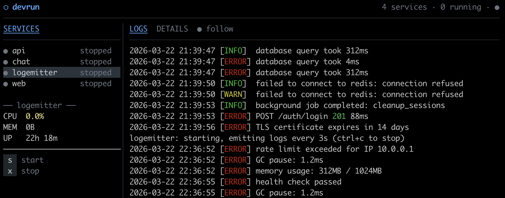

# devrun

> A lightweight process manager for developers who juggle many services.

Stop opening new terminal tabs. Stop forgetting start commands. Stop wondering what's running.
`devrun` gives you a single place to register, start, and monitor all your development services —
with a live TUI dashboard and persistent logs.



## Features

- **Register once, run anywhere** — save commands with names, no more muscle memory required
- **Targets** — group a subset of services under a name and start/stop them as a unit
- **Project-local configs** — commit a `devrun.yaml` and every command auto-uses it in that directory
- **Live TUI dashboard** — see all services, CPU/mem, uptime, and tail logs in one view
- **Persistent logs** — every service writes to its own log file; inspect anytime
- **Daemon-backed** — services stay alive after you close the terminal
- **Port detection** — devrun reports which port each service bound to
- **Attach to any service** — bring a running process to your foreground (interactive)
- **Local gateway** — one address for everything you are running, with a clickable index
- **Optional publishing** — put the gateway behind a Cloudflare tunnel, or front it yourself
- **Works with AI agents** — Claude Code, Codex and other MCP clients can add, start and stop services and read their logs (`devrun mcp`), with a Claude Code plugin that steers them to it instead of a raw shell

---

## Installation

### curl installer (macOS / Linux) — recommended

```sh
curl -fsSL https://raw.githubusercontent.com/hailerity/devrun/main/scripts/install.sh | sh
```

Installs to `/usr/local/bin` (or `~/.local/bin` if you don't have sudo).
Pin a specific version with `DEVRUN_VERSION=v1.2.3 curl ... | sh`.

### go install

```sh
go install github.com/hailerity/devrun/cmd/devrun@latest
```

Requires Go 1.26+. The binary is placed in `$GOPATH/bin` (usually `~/go/bin`).

### Verify

```sh
devrun --version
```

---

## Quick Start

### Global services

```sh
# 1. Register your services
devrun add web "yarn dev"         --cwd ~/projects/app --group fullstack
devrun add api "go run ./cmd/api" --cwd ~/projects/app --group fullstack

# 2. Start everything
devrun start --all

# 3. Check what's running
devrun list

# 4. Open the live dashboard
devrun

# 5. When you're done
devrun stop --all
```

### Project-local workflow

```sh
# In any directory with a devrun.yaml, every command uses it automatically
devrun up       # register + start all services
devrun list     # check status (scoped to this project)
devrun          # open dashboard
devrun down     # stop all project services

devrun list --global   # ignore devrun.yaml, act on the global registry
```

---

## Commands

### Service Registration

| Command | Description |
|---|---|
| `devrun add <name> <cmd>` | Register a new service |
| `devrun remove <name>` | Remove a service |
| `devrun list` | List all services with status |

**`devrun add` options:**

```
--cwd <path>      Working directory (default: current dir)
--env KEY=VALUE   Set environment variable (repeatable)
--group <name>    Assign to a group (ignored when writing to a devrun.yaml)
```

### Lifecycle

| Command | Description |
|---|---|
| `devrun start <name>` | Start a service |
| `devrun start --all` | Start all registered services |
| `devrun start <name> --fg` | Start and attach terminal |
| `devrun stop <name>` | Stop a service |
| `devrun stop --all` | Stop all running services |

### Targets

A target is a named subset of services you can start and stop together — handy
when a config holds many services but you only need a few at a time.

| Command | Description |
|---|---|
| `devrun target create <name>` | Create a new, empty target |
| `devrun target add <name> <service>...` | Add services to a target (creates it if needed) |
| `devrun target rm <name> [service]...` | Remove services, or the whole target when none are given |
| `devrun target list` | List targets, their members, and which are running |
| `devrun target start <name>` | Start every service in the target |
| `devrun target stop <name>` | Stop the target's services, keeping any still held by another running target |

Targets are stored in whichever config is active — the project `devrun.yaml`
when one is present, otherwise the global `services.yaml`. `target stop` uses the
member list captured when the target was started, so editing membership while it
runs doesn't change what a later stop releases. It stops every member in that
snapshot — including any that were already running when the target started —
except services another active target still holds.

### Observability

| Command | Description |
|---|---|
| `devrun logs <name>` | Print last 100 log lines |
| `devrun logs <name> -f` | Follow log output (like `tail -f`) |
| `devrun logs <name> -n 50` | Print last N lines |
| `devrun info` | Version, daemon, gateway and tunnel state, and where every file lives |
| `devrun info <name>` | One service: state, command, directory, env, URLs |

### Publishing

| Command | Description |
|---|---|
| `devrun gateway up` | Serve every running service from one address |
| `devrun gateway status` | What it serves, and whether anything off this machine can reach it |
| `devrun gateway expose <name>...` | Allow services to leave this machine |
| `devrun gateway hide <name>...` | Stop them leaving it |
| `devrun gateway down` | Stop the gateway, and any tunnel over it |
| `devrun tunnel up [name...]` | Publish over a Cloudflare tunnel, starting the gateway if needed |
| `devrun tunnel status` | What is published, and where |
| `devrun tunnel down` | Stop publishing; the gateway keeps serving locally |

See [Local gateway and publishing](#local-gateway-and-publishing).

### Interaction

| Command | Description |
|---|---|
| `devrun` | Open interactive TUI dashboard |
| `devrun fg <name>` | Attach stdin/stdout to a running service |
| `devrun mcp` | MCP server for AI agents — started by the agent, see [Using devrun from an AI agent](#using-devrun-from-an-ai-agent) |

### Project-local Workflow

| Command | Description |
|---|---|
| `devrun up` | Register + start all services from `devrun.yaml` |
| `devrun down` | Stop all services from `devrun.yaml` |

---

## Configuration

### Config resolution

Every command picks its config automatically:

- If the current directory contains a `devrun.yaml`, that file is the config — `list`, `start`, `stop`, `info`, `add`, `remove`, `target`, and the TUI dashboard all operate only on its services, and `add`/`remove`/`target` edit the file in place.
- Otherwise the global registry (`~/.config/devrun/services.yaml`) is used, which holds only services you registered with `devrun add`.
- `--global` / `-g` forces the global registry even when a `devrun.yaml` is present (not valid for `up`/`down`).

Project services are sent to the daemon with their full definition inline and are never written to `services.yaml`. `devrun daemon restart` re-execs in place and hands running services (with their definitions and live log capture) to the replacement, so nothing is lost. But if the daemon instead *crashes* or is stopped with `devrun daemon stop`, a running project service keeps running yet the next daemon no longer knows its command — and log capture is paused — until you re-run `devrun up` in that directory.

### Project-local: `devrun.yaml`

Place this file in your project root and commit it. Running `devrun up` starts every service in the daemon, grouped under the project name. The definitions are sent to the daemon inline for the duration of the run — they are not written to the global `services.yaml` (see [Config resolution](#config-resolution) above).

```yaml
name: myapp      # optional — defaults to directory name

services:
  web:
    command: yarn dev
    cwd: ./frontend  # relative to devrun.yaml; defaults to project root
    env:
      PORT: "3000"
      NODE_ENV: development

  api:
    command: go run ./cmd/api
    env:
      PORT: "4000"

  db:
    command: postgres -D ./pgdata

# Optional: named subsets you can start/stop as a unit.
targets:
  frontend: [web]
  backend:  [api, db]
```

### Global registry: `~/.config/devrun/services.yaml`

Managed automatically by `devrun add/remove`. You can also edit it directly.

---

## Local gateway and publishing

`devrun gateway up` serves everything you are running from one address, with an
index at the root you can click through.

```sh
devrun gateway up          # http://localhost:7788/
```

On loopback it needs no configuration and applies no controls — anything that
can open `localhost:7788` can already open `localhost:4200` directly, so there
is nothing to gate. The controls switch on the moment it can be reached from
somewhere else.

### Four ways to use it

| what you want | config | `devrun tunnel up`? |
|---|---|---|
| local only | nothing | never |
| a phone on the same wifi | `gateway.bind: 0.0.0.0` | never |
| your own tunnel or reverse proxy | `gateway.posture: published` | never |
| devrun runs cloudflared for you | asked on first use, then saved | yes |

cloudflared is not a dependency. It is absent from `go.mod` and from the
binary, and never looked for unless you publish.

### Two postures

|  | serves | allowlist | token |
|---|---|---|---|
| **local** | every running service | not applied | not required |
| **published** | only `gateway.expose` | applied | required |

Published is derived, not declared: a devrun-run tunnel, a non-loopback bind,
or a request arriving with a `Host` the gateway does not recognise as itself.

**That last check is defence in depth, not a guarantee.** Front the gateway
with something that rewrites `Host` to `localhost` — some proxies do — and it
will still think it is local while the world can reach it. If you publish it
yourself, say so:

```yaml
gateway:
  posture: published
```

On a shared machine, loopback is not a trust boundary either. `auth: always`
keeps the token on locally.

### Handing over the key

`devrun gateway status` prints the token, whether or not a tunnel is running;
`devrun tunnel up` prints it too, since publishing is what usually starts it
being asked for. There are three ways to present it:

| | How | Good for |
|---|---|---|
| **Link** | `https://…/?k=<token>` | Sharing — the link carries the key |
| **Form** | Paste it on the page the gateway answers with | Whoever has the token but no link |
| **Header** | `Authorization: Bearer <token>` | `curl`, and anything that is not a browser |

The first two trade the token for an `HttpOnly` cookie, so it is presented once
rather than on every link that follows.

**Prefer the form when you have the token to hand.** A pasted key never enters
the address bar, the browser's history, a `Referer` header or the tunnel's
request log; `?k=` is in a URL for one round trip before it is traded away. The
form is no weaker a gate — the token is 128 bits of randomness, so neither can
be guessed, and the page answers a wrong key exactly as it answers a missing
one, so it never confirms a near miss.

A key entered in the form lands you on the index rather than the page you asked
for. That is deliberate: carrying a destination through the form would make the
denial page differ by the path that was requested, and it is identical for every
path so that a stranger cannot learn which services exist.

### How a request names a service

Two shapes, and both always resolve whatever the mode says — `mode` only
decides which one the index advertises.

```
subdomain   web.localhost:7788          one origin per service
path        localhost:7788/web/         one origin for everything
```

**Locally, prefer subdomain.** It is free: browsers resolve `*.localhost` to
loopback with no setup, and it keeps a frontend's relative `/api/...` calls
working through its own dev server's proxy, exactly as they do at
`localhost:4200`. Reaching the gateway at an **IP** forces path links, because
`web.127.0.0.1` resolves nowhere — so open it by name. Every URL devrun prints
for a loopback gateway uses `localhost` for that reason, and names each service
the way the gateway would link to it.

### Path mode breaks root-absolute asset URLs

An app served at `/web/` that asks for `/@vite/client` is asking the *gateway*
for it, not the app, and gets a 404. Give one service the root:

```yaml
gateway:
  routes:
    "/":    web
    "/api": { service: api, strip: false }
```

Now `/@vite/client` reaches `web` untouched, `/api/users` reaches `api` still
spelled `/api/users`, and both share one origin — so there is no CORS between
them either. With two frontends only one can hold `/`; the second needs its own
base path (Vite's `base`, Angular's `--base-href`, webpack's `publicPath`).

**A catch-all `"/"` rule is matched before the Host label**, so once you have
one, the subdomain URLs all resolve to whatever sits at the root.

### Publishing

```sh
devrun tunnel up web api     # publishes these two, and starts the gateway
devrun tunnel status
devrun tunnel down           # the gateway keeps serving locally
```

Asked once on first use, then remembered:

```
No tunnel configured.

  A hostname gives a stable URL. It needs a Cloudflare account and three
  commands, which devrun will not run for you:

      cloudflared tunnel login
      cloudflared tunnel create devrun
      cloudflared tunnel route dns devrun devrun.example.com

  Blank gives a quick tunnel instead: no account, nothing to set up, and
  a new URL every run.

  hostname (blank for a quick tunnel): devrun.example.com
  cloudflared tunnel [devrun]:

Saved tunnel.name and tunnel.hostname to ./devrun.yaml

Your setup, with the values just saved — skip whatever is already done:

    cloudflared tunnel login
    cloudflared tunnel create devrun
    cloudflared tunnel route dns devrun devrun.example.com

That hostname is the tunnel's own, where the service index is served, and
in path mode the only record there is. Giving each service a hostname adds
one record per published service; devrun resolves them all once the tunnel
is up and names any that is missing.
```

The commands appear above the question because that is the decision they
inform — a stable URL costs a Cloudflare account and three commands, a quick
one costs nothing. They are repeated underneath with the answers filled in, so
they can be pasted.

Off a terminal it never asks — an agent or a script gets a quick tunnel and a
printed note. A quick tunnel needs no account, no DNS and no login, and its
URL changes every run.

A named one needs three things on your Cloudflare account first, none of which
devrun creates:

```sh
cloudflared tunnel login
cloudflared tunnel create devrun
cloudflared tunnel route dns devrun devrun.example.com
```

That third hostname is the tunnel's own — where the service index is served,
and in path mode the only record there is.

### What a published subdomain costs

Each service needs a hostname, and **a certificate that covers it**. Cloudflare's
Universal SSL covers the apex and one wildcard level, so `web.devrun.example.com`
— two labels deep — is refused at the TLS handshake, not merely distrusted.

```yaml
gateway:
  public_hostname: "{service}-devrun.example.com"
```

| shape | DNS | certificate |
|---|---|---|
| `{service}-devrun.example.com` | one CNAME per service | free |
| `{service}.example.com` | one CNAME per service, or `*.example.com` | free |
| `{service}.devrun.example.com` | `*.devrun.example.com` | needs Advanced Certificate Manager |
| *unset* — path mode | none beyond the tunnel's own | free |

Each of those is **on top of** the tunnel's own record, which stays needed in
every shape.

The namespaced form is the one to reach for on a domain you use for anything
else: without the suffix, a service called `api` quietly claims
`api.example.com`.

devrun does not write DNS records — that needs write access to your zone it has
no business holding — but it prints the command for any that are missing:

```
3 hostnames do not resolve yet:
    cloudflared tunnel route dns devrun devrun.example.com
    cloudflared tunnel route dns devrun web-devrun.example.com
    cloudflared tunnel route dns devrun api-devrun.example.com
```

### Telling an app where its backend is

Most projects need nothing here: a frontend's dev server proxies `/api` and the
relative call keeps working through the gateway. For an app that must call an
absolute URL, devrun injects one per service:

```
DEVRUN_URL_API = http://localhost:3000             # local
DEVRUN_URL_API = https://api-devrun.example.com    # published
```

Frameworks filter the environment by prefix — Vite exposes only `VITE_`, Create
React App only `REACT_APP_` — so bridge it in config:

```yaml
services:
  web:
    env:
      VITE_API_URL: "${DEVRUN_URL_API}"
```

`${NAME}` only; a bare `$NAME` is left alone so passwords and shell snippets
survive, and `$$` is a literal `$`.

Dev servers read their environment once, at startup, so a service already
running when you publish still holds the local value:

```sh
devrun tunnel up --restart-exposed
```

### The index is read-only

It lists services and links to them. No start, no stop, no logs. Anything more
and a leaked token stops being "someone can see my dev app" and becomes remote
process control on your machine.

---

## TUI Dashboard (`devrun`)

```
 ⬡ devrun  shop · devrun.yaml                          2/3 running  ✖ 1 crashed
╭─ SERVICES · frontend ───────╮╭─ web  ● running :5173  up 2h 14m ─ [LOGS] details ─╮
│ ✖ chat      crashed         ││ → GET  /api/users    200  12ms                     │
│ ● api       :8080      2.1% ││ → POST /api/auth     201  45ms                     │
│ ● web       :5173     64.0% ││ → GET  /api/profile  200   8ms                     │
╰─ 2/3 up ────────────────────╯╰─ 1,204 lines ─────────────────────────── ⇣ follow ─╯
 s start  x stop  r restart  ↵ details  / filter  t target        ? help  q quit
```

Each service row shows a state glyph (`●` running, `◐` starting / stopping,
`○` stopped, `✖` crashed), the name, the port or state, and CPU. The list is
alphabetical and stays that way: a service that crashes keeps its row rather
than jumping the queue, so the list never reshuffles under the cursor. The
focused pane has the accent-coloured border, and the main pane's border always
names the service whose logs or details it shows. Colours adapt to light and
dark terminals.

When more than one `group` is in play the list is **sectioned by group**, with a
header per group carrying its running count:

```
╭─ SERVICES ──────────────────╮
│ ▾ backend              2/3  │
│ ● api       :8080     2.1%  │
│ ● db        :5432     0.4%  │
│ ✖ worker    crashed         │
│ ▸ frontend             1/2  │
│ ▾ ungrouped            0/1  │
│ ○ scratch   stopped         │
╰─ 3/6 up ────────────────────╯
```

`Space` (or `↵`) on a header folds the group shut; the cursor walks headers as
it does in a file tree. Groups are alphabetical with the ungrouped ones last,
and a header only appears when there is more than one group — a single project
looks exactly as it did before. A group's services keep their place inside it,
so a service still never moves because its state changed.

Two things worth knowing about folding:

- **A collapsed group hides what is inside it, including a failure.** The
  header's count (`1/3`) is the only hint; there is no crash marker on a folded
  group. That is deliberate — collapsing hides what it hides.
- **An active `/` query suspends every fold**, so a match is never hidden
  behind one. The folds come back as they were when the query is cleared.

Where the group comes from: a `devrun.yaml` gives every one of its services the
project's name, so a project is a group. In the global registry, `devrun add
--group` sets it per service.

The sidebar is one list of services, and two things can narrow it:

- **`/` filters by name** — with the sidebar focused, `/` opens a query input
  and the list narrows as you type (case-insensitive substring, so `web` finds
  both `web` and `webhook`). `↵` keeps the filter. `Esc` **in the input**
  cancels, putting back the query it opened on — which is no filter for a fresh
  one, or the previous query when you reopened `/` to amend an existing filter.
  `Esc` **on the list**, once the filter is in force, clears it.
- **`t` opens the target picker** when the active config defines targets: every
  target with its running count and members. `↵` filters the list to that
  target, `All services` clears the filter, and `e` edits the highlighted
  target.

Both apply at once — a query searches within the filtering target — and the
SERVICES heading names whichever are active (`SERVICES · frontend · /web`), so
the reason a service is missing from the list is always on screen.

**Navigation:**

| Key | Action |
|---|---|
| `k` / `↑` | Move up |
| `j` / `↓` | Move down |
| `←` / `→` | Focus sidebar / main panel |
| `Tab` | Toggle focus between sidebar and main panel |
| `↵` | Toggle DETAILS / LOGS for the selected service (on a group header: fold it) |
| `Esc` | Back out of DETAILS to LOGS |

On a terminal narrower than 70 columns only the focused pane is shown, at full
width: `Tab` swaps panes, and `↵` on a service opens it.

**Service / target control:**

| Key | Action |
|---|---|
| `s` / `x` | Start / stop the selected service |
| `r` | Restart the selected service (starts it if it is not running) |
| `S` / `X` | Start / stop everything the list is showing — narrowed by `/` and `t`, or every service when neither is active |
| `/` | Filter the service list by name (sidebar focused — `↵` keeps it, `Esc` in the input cancels, `Esc` on the list clears) |
| `Space` | Fold or unfold the group under the cursor (group headers only; `↵` does the same there) |
| `t` | Open the target picker (`↵` filter, `e` edit target, `Esc` close) |
| `e` | Edit the selected service (sidebar focused) |
| `d` | Remove the selected service (sidebar focused, asks to confirm) |

Under a `/` query, `S` / `X` act on the named services one by one rather than on
the target as a unit. That is the point — you narrowed the list to those rows —
but it means `X` will stop a service even when another started target still
holds it, where `X` on an unqueried target leaves such a member running.

Pressing `e` opens a modal editor. It writes back to the active config — the
project `devrun.yaml` when one is in scope, otherwise `~/.config/devrun/services.yaml` —
using the same resolution as `devrun add`.

- **On a service** (`e` in the sidebar) the modal edits the service's name, command, and working
  directory. Saving refuses an empty name or command, or a name that collides
  with another service. If the edited service is running it is stopped and
  restarted (under the new name, on a rename) so the change takes effect
  immediately.
- **On a target** (`e` in the target picker) the modal edits the target's name and members: a name
  field plus a checklist of every service — `Tab` switches between the two,
  `space` toggles a service in or out. Saving refuses an empty name or one that
  collides with another target. A running target keeps its current membership
  until you stop and start it again.

Pressing `d` on a service asks to confirm, then deletes that service from
the active config — the same file `e` writes to, the same effect as
`devrun remove`. A running service must be stopped first.

**Log panel:**

| Key | Action |
|---|---|
| `/` | Search the log (main panel focused) — matches highlight as you type, `↵` jumps to the nearest match above the cursor, `Esc` cancels |
| `n` / `N` | Next match down / previous match up (wraps) |
| `f` | Toggle follow mode |
| `g` / `G` | Jump to top / jump to the end and follow |
| `w` | Toggle line wrap |
| `v` | Enter visual selection mode |
| `y` / `Ctrl+C` | Copy selection (or current line) |
| `Esc` | Exit visual mode, then clear the search |

The log pane's bottom border shows the line count, the match position while a
search is active (`2/17 matches`), and the follow state. With follow off it
counts lines that arrived out of view (`↓ 37 new`); `G` jumps to them.

**Details panel (main panel focused, Details tab):**

| Key | Action |
|---|---|
| `j` / `k` | Move over the values; the list scrolls |
| `g` / `G` | First / last value |
| `y` | Copy the value under the cursor — the full value, even if the pane truncated it |

**Global:**

| Key | Action |
|---|---|
| `?` | Show every key, grouped |
| `q` / `Ctrl+C` | Quit |

The footer shows the keys for the focused pane. On a narrow terminal it drops
whole hints, least useful first; `? help` and `q quit` always stay.

---

## Using devrun from an AI agent

Coding agents start dev servers all the time, and do it badly: they block on a
foreground `npm run dev`, background it and lose the output, or leave
processes behind. `devrun mcp` is a [Model Context Protocol](https://modelcontextprotocol.io)
server that lets an agent hand those processes to devrun instead. The agent
drives the same daemon you do, so whatever it starts shows up live in your
`devrun` dashboard, and the reverse.

### Set up

**Claude Code — plugin (recommended)**

The plugin wires up the MCP server *and* a skill that tells the agent to reach
for devrun when it needs a dev server, rather than leaving it to notice the
tools on its own:

```bash
claude plugin marketplace add hailerity/devrun
claude plugin install devrun@hailerity
```

or, in a session, `/plugin marketplace add hailerity/devrun` followed by
`/plugin install devrun@hailerity`.

To try it without installing, `claude --plugin-dir ./plugin` loads it for one
session.

**Claude Code — MCP server only**

```bash
claude mcp add devrun -- devrun mcp              # this project only
claude mcp add -s user devrun -- devrun mcp      # every project
claude mcp add -s project devrun -- devrun mcp   # shared with the team via .mcp.json
```

These give you the tools without the skill. If you have done this *and* then
install the plugin, your own entry takes precedence and the plugin's is
ignored — both define the same `devrun mcp` command, so nothing breaks, but
`claude mcp list` will mention the conflict.

The project scope writes a `.mcp.json` you can commit:

```json
{
  "mcpServers": {
    "devrun": { "command": "devrun", "args": ["mcp"] }
  }
}
```

**Codex**

```bash
codex mcp add devrun -- devrun mcp
```

or in `~/.codex/config.toml`:

```toml
[mcp_servers.devrun]
command = "devrun"
args = ["mcp"]
```

Any other MCP client that can launch a stdio server works the same way:
the command is `devrun mcp`. Run by hand in a terminal, `devrun mcp` just
prints these instructions.

### Tools

| Tool | What it does |
|---|---|
| `list_services` | Every service and target in scope, with live state, PID, port, uptime, CPU/memory and the URL it can be opened at |
| `service_status` | One service's state and definition — command, directory, env variable **names** (never values), last exit code |
| `gateway_status` | What the gateway serves, its posture, what may leave the machine, and the public URL when a tunnel is running. Never the token |
| `logs` | The end of a service's output as plain text: 100 lines by default, at most 1000 and 64 KB, optionally filtered |
| `add_service` | Define a new service in the project's `devrun.yaml` (or the global registry). Refuses an existing name |
| `add_to_target` | Create a target or add services to it |
| `start` | Start a service or target and **wait for the outcome**: running, or crashed / exited / failed with the end of its log |
| `stop` | Stop a service or target. Stopping something that is not running is fine |

`start` does not report success the moment a process is spawned. It waits
until the service has stayed up for a short settle period (2 s), so a crash
just after boot comes back as `crashed` with the log lines that explain it —
in the same call.

**Which config?** Every tool takes an optional absolute `project_dir`
(default: the directory the agent launched `devrun mcp` in) and uses that
directory's `devrun.yaml`, or the global registry when it has none. Every
result names the file it used. Pass `global: true` to use the global registry
even inside a project.

### Permissions

`list_services`, `service_status` and `logs` only read, and are marked
read-only. `add_service` followed by `start` runs whatever command the agent
chose — no more than a shell tool already allows, but worth a prompt. A
reasonable Claude Code setup auto-approves the read-only tools and asks for
the rest, in `.claude/settings.json`:

```json
{
  "permissions": {
    "allow": ["mcp__devrun__list_services", "mcp__devrun__service_status", "mcp__devrun__logs"]
  }
}
```

Agents cannot remove or edit services, or control the daemon.

### Good to know

- **Tool timeouts.** `start` waits 15 s by default and accepts up to 120 s
  (`timeout_s`). Clients cap how long a tool call may take — Codex's default
  `tool_timeout_sec` is 60 — so raise that setting before asking for longer
  waits.
- **Log files are named by service.** Two projects that both define `api`
  share `~/.local/share/devrun/logs/api.log`.
- **Names** of services and targets an agent creates are limited to letters,
  digits, `.`, `_` and `-`.

---

## File Locations

| Path | Purpose |
|---|---|
| `~/.config/devrun/services.yaml` | Global service registry |
| `~/.local/share/devrun/state.json` | Runtime state (PID, status, port) |
| `~/.local/share/devrun/logs/` | Log files per service (`<name>.log`) |
| `~/.local/share/devrun/logs/devrun/` | devrun's own logs — `gateway.log`, `tunnel.log` |
| `~/.local/share/devrun/devrun.sock` | Daemon Unix socket |
| `devrun.yaml` | Project-local service definitions |

---

## Why not PM2 / Overmind / tmux?

| Tool | Problem |
|---|---|
| PM2 | Node.js-only, heavyweight, complex API |
| Overmind / Foreman | Procfile-only, no global registry, no TUI |
| tmux / zellij | Manual setup, no process awareness |
| Docker Compose | Containers only, heavy for local dev |

`devrun` is polyglot, minimal, and built for the developer's local machine — not production.

---

## License

MIT
